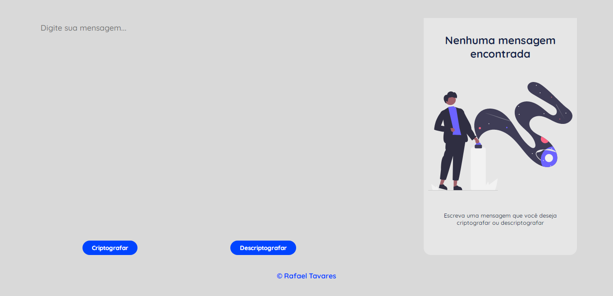

<h1 align="center">Text Decoder</h1>

Esta é minha solução para o primeiro challenge do programa ONE.

Sumário
===========
<!--ts-->
  * [Sobre](#sobre)
  * [Screenshot](#screenshot)
  * [Como usar](#como-usar)
  * [Status](#status)
  * [Funcionalidades](#funcionalidades)
  * [Tecnologias](#tecnologias)
  * [Autor](#autor)
<!--te-->

Sobre
-----

Esse projeto é o primeiro desafio do projeto ONE - Oracle Next Education, é um decodificador onde um texto é inserido e as vogais são transformadas em outros textos.

O projeto é muito interessante e foi muito bom para exercitar lógica de programação e solução de problemas.

Para a fazer a descriptografia eu criei uma variável que detecta se o usuário criptografou uma mensagem ou não, isso porque o usuário inserir um texto para ser descriptografado ou descriptografar o texto que ele acabou de criptografar. Desta forma a variável auxília o algoritmo a pegar o texto inserido ou o resultado.

Além disso eu usei um objeto para fazer as trocas de palavras e fiquei muito feliz de ter conseguido manipular o objeto e seus dados.

Screenshot
----------

Como Usar
---------

Você pode acessar o site clicando <a href="https://github.com/rafatavares03/text-decoder">aqui</a> ou abrindo o arquivo HTML em um navegador.

Digite o texto que você deseja criptografar ou descriptografar no campo e clique no botão para realizar a ação desejada.

Uma vez que o botão desejado for clicado será exibido o resultado na área ao lado e o botão copiar aparecerá. Ao apertar este botão, o texto resultante será copiado e você poderá colar onde desejar.

Status
------
Concluído :heavy_check_mark:

Funcionalidades
---------------
- [x] Criptografar textos
- [x] Descriptografar textos
- [X] Copiar o texto criptografado ou descriptografado
- [x] Criptografar e descriptografar textos maiúsculos ou minúsculos
- [ ] Criptografar letras acentuadas, símbolos, números e consoantes.

Tecnologias
-----------

  
  
  

Autor
------
<h3 align="center">Rafael Tavares</h3>

 <a href="https://www.facebook.com/rafael.tavares.39904/"></img></a>
 <a href="https://www.instagram.com/rafatavares03/"></img></a>
 <a hrf="https://github.com/rafatavares03"></img></a>
  <a hrf="https://www.linkedin.com/in/rafatavares03-dev/"></img></a>

